# NMovice 架构简介
 
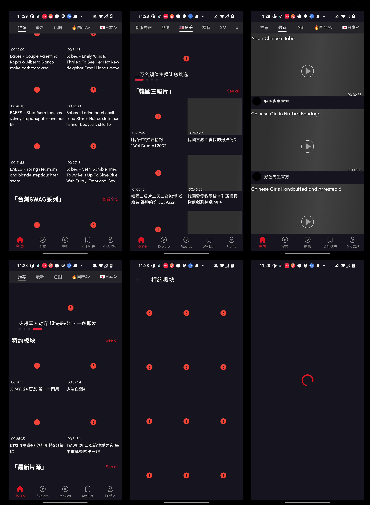 


## Instructions

1.  项目结构介绍
2.  架构图
3.  命令行工具


## 项目结构介绍

1.  App下所有网络请求是基于Bloc(用于Flutter应用程序中实现业务逻辑的状态管理库)，部分用到GetX（见onboardingpage.dart）
    所有 原服务器JSON数据结构 和 网络请求接口定义 都放在Packages > movies_api 包下，如图：
    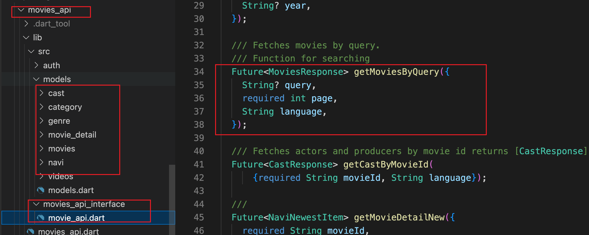
    所有实际网络请求和（RSA加密解密）封装可以以后全部放在Packages > movies_data,在项目基本引用repositories系列都是封装的网络请求类 包下,如图：
    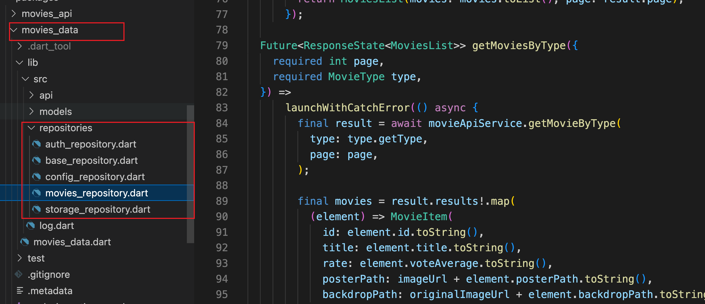
    所有本地收藏/观看列表 存储 接口定义全部放在Packages > storage_data,  包下,如图：
    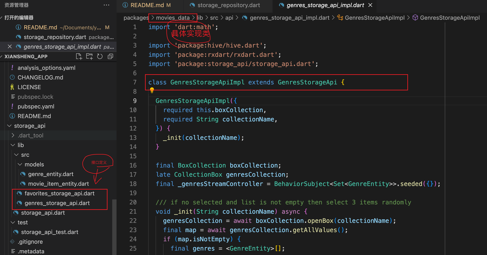

    分包放置，结构抽离，方便后面更新新的app快速迭代开发


2.  lib>app 目录基本对应整个App的主要配置，例如：主题/语言国际化切换/是否授权网络/ 后续是否登录的状态可以通过这里管理，如图：
    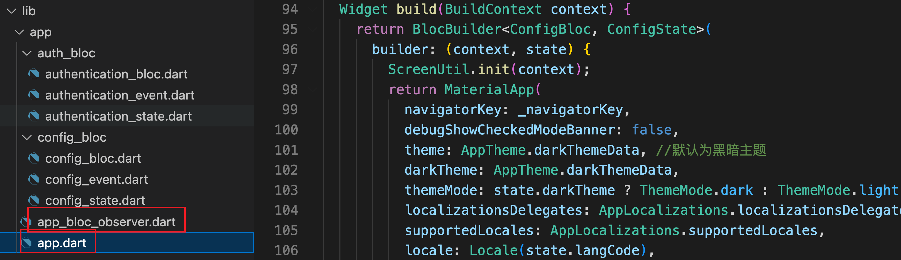
3.  lib>common 目录是部分公共的配置项: colors/public/styles 这里主要是被用于getx系列界面引用，如果后续不用可以考虑移除
4.  lib>http 主要是对网络引擎dio进一步封装，主要被用于getx系列调用
5.  lib>l10n 主要是国际化配置，具体每次新增新的字段时，需要执行命令：
    >  flutter pub run intl_translation:generate_from_arb   --output-dir=lib/l10n  lib/l10n/l10n.dart lib/l10n/*.arb
6.  lib>models 主要是部分请求的测试json类，这里要被移除掉， 如token请求类和广告数据类，这里方便测试就写在这里，后面全部可以移动到     
    Packages > movies_api 包下.
7.  lib>pages 全部放置当前App的所有页面类
8.  lib>resources 是App所有 资源类/colors/string/theme/value等
    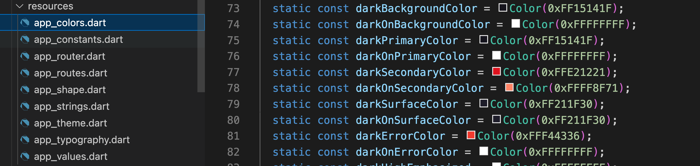
9.  lib>utils 所有全局函数定义类 如 functions/typedef等
    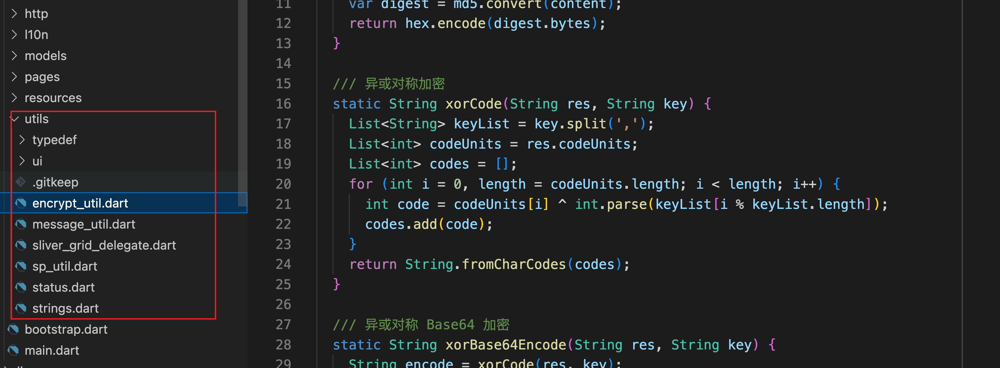


## 架构图
1. App入口配置 lib>app>app.dart
  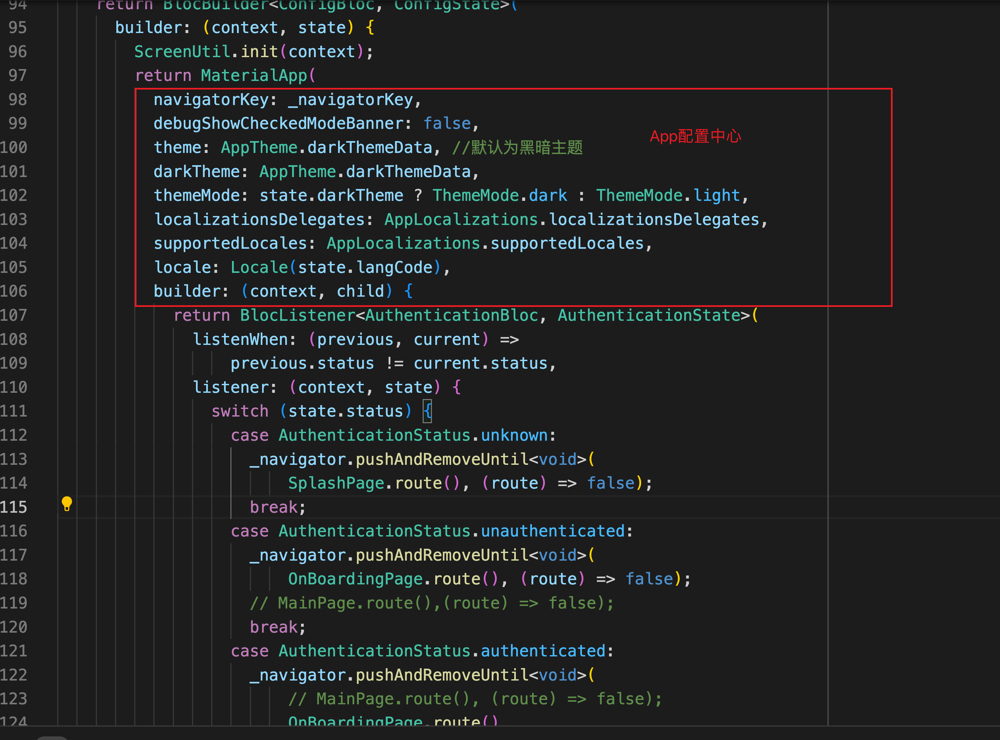
  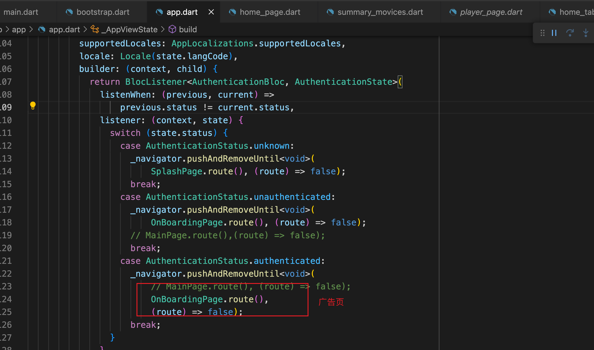

  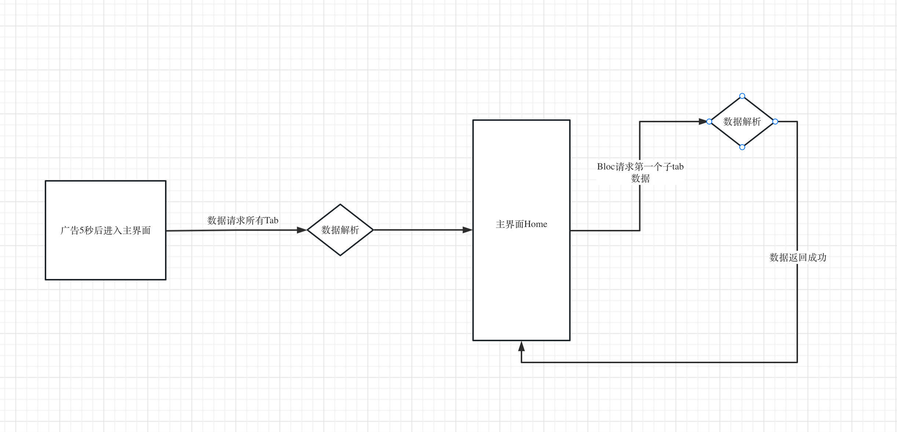
  > 流程图工具：https://www.processon.com/diagraming/6430c20fac665635d2680afb
  
  Home_page.dart 调用拼接  HomeTabNeweat+HomeTabRecommend+HomeTabOthers（Home页顶部18个子tab）然后子tab里每次通过naviid请求自己的数据

  ### 举例1说明： HomeBloc 是对应界面需要用到的所有网络状态及请求的处理中心，需要被Widget中通过：

  ```dart
  
  BlocProvider(
    create: (context) => HomeBloc(
      moviesRepository: repository(context),
    )..add(FetchUpcomingMoviesEvent()));

  ```

  引用去使用订阅，初次加载网络请求数据及app网络环境状态等。
  具体使用中通过：

  ```dart
    Widget _buildComponents(
      {required UpcomingMoviesState state, required OnRetry retry}) {
    switch (state.status) {
      case Status.success:
        return mainView(state);
      case Status.pending:
        return const ProgressView();
      //
      case Status.error:
        return ErrorView(onRetry: retry);
      case Status.empty:
        return const EmptyView();
      case Status.noConnection:
        return const NoConnectionView();
    }
  }

  ```
  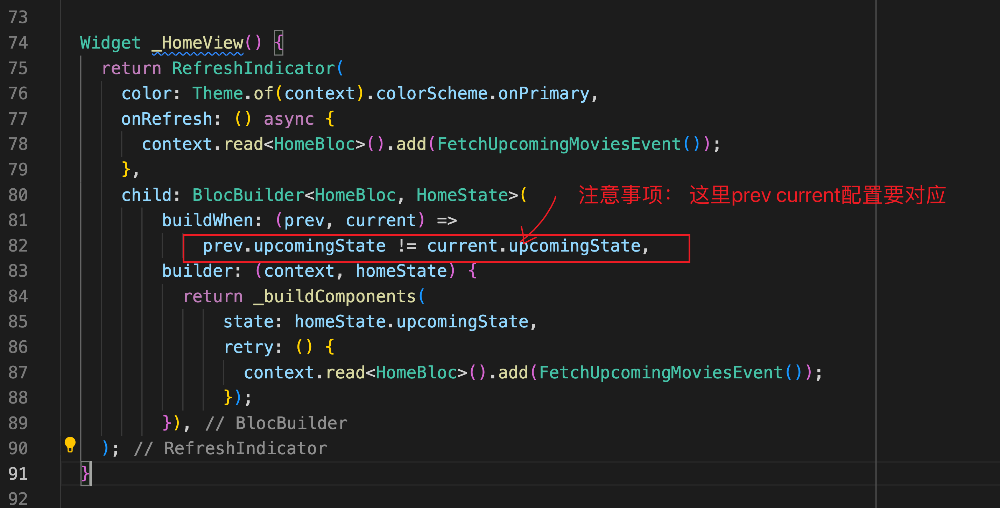

### 举例2说明：普通不通过Bloc 网络调用，快速网络请求（包含顶部下拉刷新+底部加载更多）      
```dart
@override
void initState() {
  _pagingController = PagingController(firstPageKey: 1)
    ..addPageRequestListener(_fetchPage);
  super.initState();
}
```
上面通过配置_fetchPage函数去拉取数据
```dart
Future<void> _fetchPage(int pageKey) async {
    try {
      final repository = RepositoryProvider.of<MoviesRepository>(context);

      final data = await repository.getMoviesByType(
        page: pageKey,
        type: widget.type,
      );

      final result = data.getValueOrNull();

      final movies = result?.movies ?? [];
      final isLastPage = movies.length < _pageSize;

      if (isLastPage) {
        _pagingController.appendLastPage(movies);
      } else {
        final nextPageKey = (result?.page ?? pageKey) + 1;
        _pagingController.appendPage(movies, nextPageKey);
      }
    } catch (error) {
      _pagingController.error = error;
    }
  }
```
具体代码可以参考lib>pages>home>movies_see_all.dart
  


## 命令行工具
执行 ./git.sh 
自动提交代码 
```shell
#!/bin/bash

git add .
date +%F > timefile
currentTime=$(<timefile)
git commit -m "Commit code. Update time: $currentTime "
git push    
```
